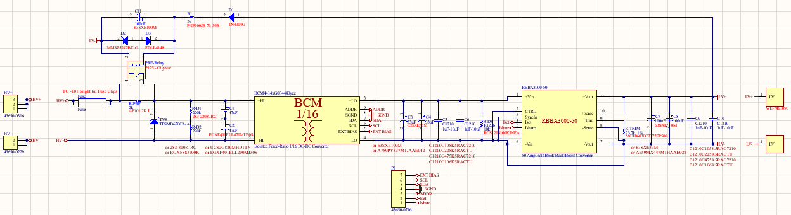
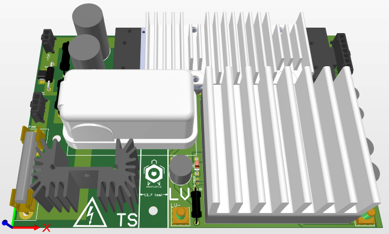
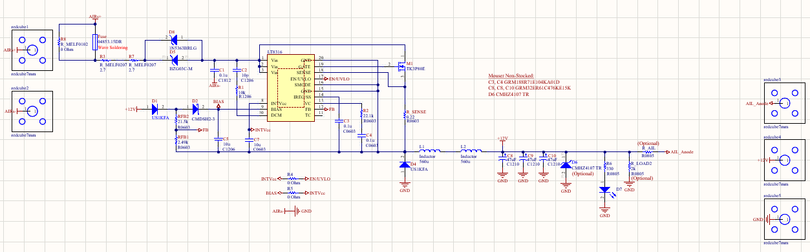
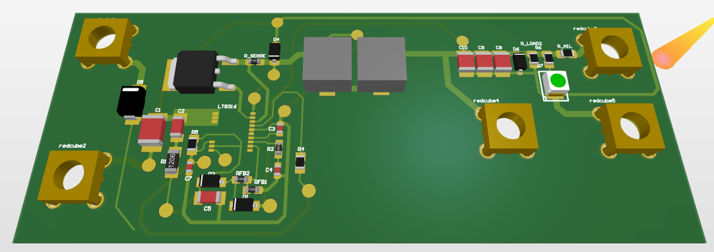

# DC-DC Converters Designs

### 600V Input, 24V Output, 25A max current DC-DC

A DC-DC Converter is designed and constructed in order to provide isolated power to the entire Low Votage System of the car. It takes a high voltage input from the Battery Pack and provides 24V for the supply of the LV System. The schematic circuit along with the PCB in 3D view are presented below.

### 600V Input, 12V Output, 200mA max current DC-DC

A DC-DC Converter is designed and constructed for the Battery Pack led indicator power supply. The led indicator is necessary for safety purposes in order to show if the voltage of the Battery Pack is larger than 60V (FSAE Standards). The schematic circuit along with the PCB in 3D view are shown below.

